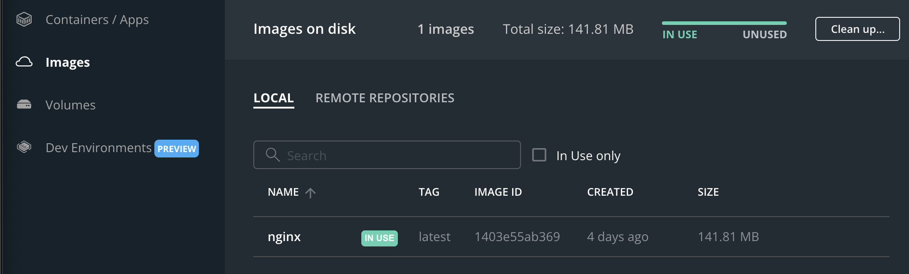
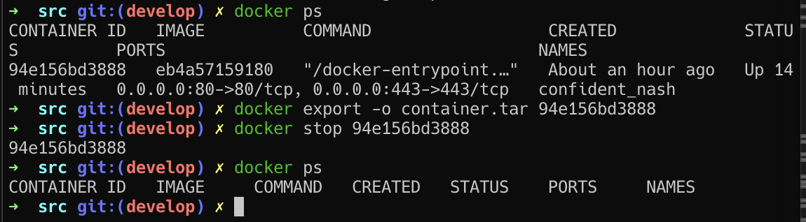
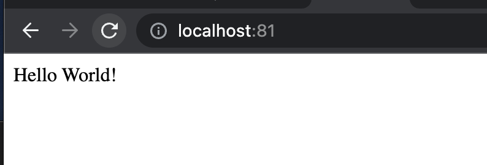

## Part 1. Готовый докер

**==Task==**

##### Взять официальный докер образ с nginx и выкачать его при помощи docker pull.

#### На официальном сайте docker нашёл описание контейнера с nginx. На странице была написана команда `docker pull nginx` для скачивания докер образа. Запускаем команду в терминале.

##### Проверить наличие докер образа через docker images.

#### В приложении Docker во вкладке Images появился образ nginx.

Также сработает такая команда:
```bash
docker images
```

##### Запустить докер образ через docker run -d [image_id|repository]
#### В консоли вводим команду `docker run nginx`, видим результат.



##### Проверить, что образ запустился через docker ps.
#### В консоли вводим команду `docker ps`, видим результат.


##### Посмотреть информацию о контейнере через docker inspect [container_id|container_name]
#### В консоли вводим команду `docker inspect admiring_blackburn`, видим результат с разной информацией о контейнере.

##### По выводу команды определить и поместить в отчёт размер контейнера, список замапленных портов и ip контейнера

#### Вывод команды сделан для контейнера с другим именем, так как я забыл сделать скрин для контейнера до его остановки и ремапинга портов. 

#### Память, выделенная контейнеру:


#### Список замапленных портов:


#### Шлюз и ip контейнера:


##### Остановить докер образ через docker stop [container_id|container_name]

##### Проверить, что образ остановился через docker ps


##### Запустить докер с замапленными портами 80 и 443 на локальную машину через команду run


Чтобы заново не создавать контейнер командой выше, можно посмотреть id того контейнера что мы запустили и ввести следующую команду:
```bash
docker run -d -p 80:80 -p 443:443 [CONTAINER ID]
```

##### Проверить, что в браузере по адресу localhost:80 доступна стартовая страница nginx


##### Перезапустить докер контейнер через docker restart [container_id|container_name]
##### Проверить любым способом, что контейнер запустился


##### В отчёт поместить скрины:

##### вызова и вывода всех использованных в этой части задания команд;
##### стартовой страницы nginx по адресу localhost:80 (адрес должен быть виден).


## Part 2. Операции с контейнером

**==Task==**

##### Прочитать конфигурационный файл *nginx.conf* внутри докер контейнера через команду *exec*
#### Узнал id контейнера с помощью ps и подключился к нему по SSH с помощью команды `docker exec -it tender_montalcini bash`
#### Далее вывел в консоль содержимое `nginx.conf` с помощью `cat /etc/nginx/nginx.conf`

##### Создать на локальной машине файл *nginx.conf*
##### Настроить в нем по пути */status* отдачу страницы статуса сервера **nginx**

##### Скопировать созданный файл *nginx.conf* внутрь докер образа через команду `docker cp`
##### Перезапустить **nginx** внутри докер образа через команду *exec*
##### Проверить, что по адресу *localhost:80/status* отдается страничка со статусом сервера **nginx**


```bash
docker cp nginx.conf [CONTAINER NAME]:/etc/nginx
docker exec [CONTAINER NAME] nginx -s reload
```
##### Экспортировать контейнер в файл *container.tar* через команду *export*
##### Остановить контейнер

```bash
docker export -o container.tar [CONTAINER ID]
docker stop [CONTAINER ID]
```
##### Удалить образ через `docker rmi [image_id|repository]`, не удаляя перед этим контейнеры

```bash
docker images
docker rmi -f nginx
```
##### Удалить остановленный контейнер

```bash
docker ps -a
docker rm [CONTAINER ID/CONTAINER NAME]
```

##### Импортировать контейнер обратно через команду *import*
##### Запустить импортированный контейнер
##### Проверить, что по адресу *localhost:80/status* отдается страничка со статусом сервера **nginx**

##### Были особенности при импортировании экспортированного образа, оказывается нужно указывать специфическую команду при импорте, саму команду нашёл по адресу в конце файла https://docs.nginx.com/nginx/admin-guide/installing-nginx/installing-nginx-docker/

### Part 3. Мини веб-сервер

**== Task ==**

##### Написать мини сервер на **C** и **FastCgi**, который будет возвращать простейшую страничку с надписью `Hello World!`


##### Запустить написанный мини сервер через *spawn-fcgi* на порту 8080


```bash
docker cp server.c [CONTAINER NAME]:/home
docker cp nginx.conf [CONTAINER NAME]:/etc/nginx
docker exec -it [CONTAINER NAME] bash
apt update
apt install gcc spawn-fcgi libfcgi-dev
```
Далее создаём исполняемый файл и пробуем запустить его
```
gcc -o comp_server server.c -lfcgi
spawn-fcgi -p 8080 ./comp_server
nginx -g "daemon off;"
```
##### Написать свой *nginx.conf*, который будет проксировать все запросы с 81 порта на *127.0.0.1:8080*

##### Проверить, что в браузере по *localhost:81* отдается написанная вами страничка

##### Положить файл *nginx.conf* по пути *./nginx/nginx.conf* (это понадобится позже)

### Part 4. Свой докер

**== Задание ==**

*При написании докер образа избегайте множественных вызовов команд RUN*

#### Написать свой докер образ, который:
##### 1) собирает исходники мини сервера на FastCgi из [Части 3](#part-3-мини-веб-сервер)
##### 2) запускает его на 8080 порту
##### 3) копирует внутрь образа написанный *./nginx/nginx.conf*
##### 4) запускает **nginx**.
_**nginx** можно установить внутрь докера самостоятельно, а можно воспользоваться готовым образом с **nginx**'ом, как базовым._


##### Собрать написанный докер образ через `docker build` при этом указав имя и тег

##### Проверить через `docker images`, что все собралось корректно

##### Запустить собранный докер образ с маппингом 81 порта на 80 на локальной машине и маппингом папки *./nginx* внутрь контейнера по адресу, где лежат конфигурационные файлы **nginx**'а (см. [Часть 2](#part-2-операции-с-контейнером))

##### Проверить, что по localhost:80 доступна страничка написанного мини сервера

##### Дописать в *./nginx/nginx.conf* проксирование странички */status*, по которой надо отдавать статус сервера **nginx**

##### Перезапустить докер образ

*Если всё сделано верно, то, после сохранения файла и перезапуска контейнера, конфигурационный файл внутри докер образа должен обновиться самостоятельно без лишних действий*
##### Проверить, что теперь по *localhost:80/status* отдается страничка со статусом **nginx**


## Part 5. **Dockle**

**== Задание ==**

##### Просканировать образ из предыдущего задания через `dockle [image_id|repository]`
```
brew install goodwithtech/r/dockle
```

##### Исправить образ так, чтобы при проверке через **dockle** не было ошибок и предупреждений


## Part 6. Базовый **Docker Compose**

Вот вы и закончили вашу разминку. А хотя погодите...
Почему бы не поэкспериментировать с развёртыванием проекта, состоящего сразу из нескольких докер образов?

**== Задание ==**

##### Написать файл *docker-compose.yml*, с помощью которого:
##### 1) Поднять докер контейнер из [Части 5](#part-5-инструмент-dockle) _(он должен работать в локальной сети, т.е. не нужно использовать инструкцию **EXPOSE** и мапить порты на локальную машину)_
##### 2) Поднять докер контейнер с **nginx**, который будет проксировать все запросы с 8080 порта на 81 порт первого контейнера
##### Замапить 8080 порт второго контейнера на 80 порт локальной машины

##### Остановить все запущенные контейнеры
##### Собрать и запустить проект с помощью команд `docker-compose build` и `docker-compose up`
##### Проверить, что в браузере по *localhost:80* отдается написанная вами страничка, как и ранее

